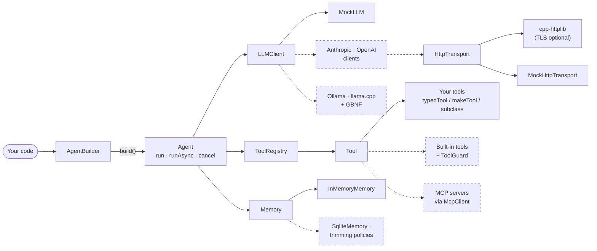

<div align="center">

# corvus

**An in-process, offline-capable AI agent runtime for C++17.**

Runs where Python can't — ROS2 nodes, game threads, drones, trading loops —
and speaks [MCP](https://modelcontextprotocol.io) so it works with the existing tool ecosystem.

[](https://github.com/Ambar-Gupta22/corvus/actions/workflows/ci.yml)
[](LICENSE)


[Quickstart](#quickstart) · [Why corvus](#why-corvus) · [Architecture](#architecture) · [Install](#install) · [Roadmap](#roadmap) · [Docs](docs/README.md)

</div>

---

> [!NOTE]
> **Early development — here's exactly what works today.**
>
> - ✅ **Shipped:** the agent loop, tool system, memory, async runs with cancellation, the offline test harness, and the HTTP transport layer, tested on Linux, macOS, and Windows.
> - 🚧 **Landing now:** real model backends, PR by PR: Anthropic and OpenAI (Phase 1), then local models via llama.cpp (Phase 2) and MCP (Phase 3). Until then, agents run against the built-in `MockLLM`.
> - `corvus` is a working name.

## Quickstart

This runs today, offline, with no API key (a trimmed version of [`examples/mock_quickstart.cpp`](examples/mock_quickstart.cpp)):

```cpp
#include <iostream>
#include <corvus/corvus.h>

struct CalcArgs { std::string expression; };

int main() {
    using namespace corvus;

    // A tool is one expression. Its args arrive as a struct: corvus builds the
    // JSON Schema from the field list and parses each call into CalcArgs.
    auto calculator = typedTool<CalcArgs>("calculator", "Evaluates a simple arithmetic expression.")
        .field("expression", &CalcArgs::expression, "e.g. '2 + 2'")
        .run([](const CalcArgs& a) -> std::string { return "4"; });

    // A scripted model: first it calls the tool, then it answers.
    auto model = std::make_shared<MockLLM>();
    model->callTool("calculator", R"({"expression":"2 + 2"})").reply("2 + 2 = 4");

    auto agent = AgentBuilder().withModel(model).withTool(calculator).build();

    RunResult result = agent.run("What is 2 + 2?");
    std::cout << result.output << "\n";  // 2 + 2 = 4
}
```

**With a real model** (Phase 1, landing now), only the model line changes:

```cpp
auto agent = AgentBuilder()
    .withModel(anthropic("claude-haiku-4-5-20251001"))   // or openai(...), ollama(...)
    .withTool(calculator)
    .build();
```

> Today `anthropic()`, `openai()` and `ollama()` throw a clear "lands in Phase 1" error, so the API is fixed now and nobody's code changes when the backends arrive.

### Never block your main loop

`runAsync` returns a `std::future`, streams tokens through a callback, and stops cooperatively when you cancel:

```cpp
CancelToken cancel;
AgentCallbacks callbacks;
callbacks.onToken = [](const std::string& chunk) { std::cout << chunk; };

std::future<RunResult> pending = agent.runAsync("Plan a route to the dock", cancel, callbacks);

// ... keep spinning your ROS2 node or rendering frames ...
if (shutdownRequested) cancel.cancel();

RunResult result = pending.get();  // result.completed == false if cancelled
```

You can safely destroy the `Agent` while a run is still in flight: the future keeps everything it needs alive.

## Why corvus

C++ has no LangChain. The workarounds hurt: embedding Python (GIL, packaging, latency), running a sidecar process, or hand-writing HTTP against each provider's API. corvus is a native runtime built around three commitments:

1. **MCP-native.** Thousands of existing [MCP](https://modelcontextprotocol.io) servers become corvus tools with no custom code. *(Phase 3)*
2. **Native tool-calling, not prompt parsing.** Structured tool-use JSON for cloud models, and grammar-constrained (GBNF) JSON for local llama.cpp models. ReAct-style text parsing is only a fallback.
3. **Async, streaming, and cancellation as first-class features.** `runAsync`, token callbacks, and a `CancelToken` checked by the agent loop and by the HTTP transport on every network read. Built for processes that must not block.

| | LangChain | llama.cpp | **corvus** |
|---|:-:|:-:|:-:|
| Language | Python | C/C++ | **C++17** |
| Embeddable in a C++ process | ❌ | ✅ | ✅ |
| Full agent loop (tools, memory, strategies) | ✅ | ❌ inference only | ✅ |
| Non-blocking, cancellable runs | ❌ | n/a | ✅ |
| Cloud models (Anthropic, OpenAI) | ✅ | ❌ | 🚧 Phase 1 |
| Offline local models | partial | ✅ | 🚧 Phase 2 |
| MCP tool ecosystem | partial | ❌ | 🚧 Phase 3 |

## Architecture

Small, single-purpose units behind stable interfaces. Every seam can be swapped, and every seam can be mocked.



<sub>**Solid** = shipped and tested. **Dashed** = planned (see [Roadmap](#roadmap)).</sub>

**How a run works.** The agent sends the conversation and the tool list to the model. If the model asks for tools, the agent runs them, adds the results to memory, and asks again. This repeats until the model answers, the run is cancelled, or it hits `maxIterations`.

**Guarantees the design is built on**

- **Tools never throw.** They return a typed `ToolResult` (ok / retryable / fatal / timeout / cancelled). The loop branches on the status; the model sees a clean `"ERROR: …"` message. `makeTool` enforces this for you.
- **Conversation history matches real provider formats.** Each tool result is paired with the call that requested it, so the history can be sent to Anthropic or OpenAI as is.
- **No silent tool hijacking.** Registering a second tool under an existing name is an error unless you explicitly choose to replace it.
- **One run at a time per agent,** enforced. Build a second agent for concurrent work.
- **Public headers are a contract.** Standard types only; third-party libraries are linked privately and never leak into your build.
- **Security is designed in, not bolted on.** The HTTP transport rejects header injection and `user@host` URL tricks, caps response sizes, and never follows redirects. Every dangerous built-in tool will ship with a `ToolGuard` (path jail, private-IP block, output caps), because raw outbound HTTP from an LLM is an SSRF risk.

For the full picture, see [docs/ARCHITECTURE.md](docs/ARCHITECTURE.md).

## Install

**CMake FetchContent** (recommended):

```cmake
include(FetchContent)
FetchContent_Declare(corvus GIT_REPOSITORY https://github.com/Ambar-Gupta22/corvus GIT_TAG main)
FetchContent_MakeAvailable(corvus)
target_link_libraries(your_target PRIVATE corvus::corvus)
```

Our tests are skipped automatically when corvus is used as a dependency. After `cmake --install`, `find_package(corvus)` works too. Pin a release tag once v0.1 ships; until then, `main` is kept green.

**Requirements:** CMake ≥ 3.18, a C++17 compiler (GCC ≥ 9, Clang ≥ 10, MSVC 2019+). Dependencies are fetched automatically. OpenSSL is optional: with it you get HTTPS; without it corvus still builds, since offline and local use doesn't need it.

## Build from source

```bash
cmake -S . -B build -DCORVUS_BUILD_EXAMPLES=ON
cmake --build build --config Release
ctest --test-dir build -C Release --output-on-failure
```

| Option | Default | What it does |
|---|---|---|
| `CORVUS_BUILD_TESTS` | ON when top-level | Build the test suite |
| `CORVUS_BUILD_EXAMPLES` | OFF | Build `mock_quickstart` |
| `CORVUS_ENABLE_TLS` | ON | HTTPS via OpenSSL, if found |

## Testing

The whole suite runs **offline, deterministically, and without API keys**. A scripted `MockLLM` plays the model and a scripted `MockHttpTransport` plays the network, so client wire formats can be checked byte for byte without opening a socket. CI builds and tests on Linux (GCC, Clang), macOS (Clang), and Windows (MSVC), plus AddressSanitizer, UndefinedBehaviorSanitizer, and ThreadSanitizer jobs. Every behavior change lands with a test.

## Roadmap

Framework first; each phase goes spec → plan → build, landing as reviewed, CI-gated PRs.

- [x] **Phase 0 — foundations:** agent loop, tool system, memory, MockLLM, 3-OS CI + sanitizers ([hardened](docs/specs/2026-07-06-phase0-hardening-design.md))
- [ ] **Phase 1 — cloud backends** ← *in progress*
  - [x] Mockable HTTP transport ([PR #1](https://github.com/Ambar-Gupta22/corvus/pull/1))
  - [ ] `AnthropicClient`: native tool-calling, SSE streaming, typed errors
  - [ ] `OpenAIClient` (Chat Completions; also covers Ollama, vLLM, and OpenRouter via `baseUrl`)
  - [ ] Retries + backoff · per-tool timeout · SqliteMemory · memory trimming · usage/cost · Calculator + guarded HttpRequest tools
- [ ] **Phase 2 — local-first:** Ollama + llama.cpp + GBNF, jailed file I/O, token-budget memory, Raspberry Pi demo
- [ ] **Phase 3 — MCP-native:** `McpClient` (stdio + HTTP/SSE), the MCP ecosystem as your toolbox
- [ ] **Phase 4 — multi-agent orchestration:** orchestrator, event bus, parallel execution, tool policy/RBAC
- [ ] **Phase 5 — flagship demos:** ROS2 planner node, game NPC
- [ ] **Phase 6 — launch**

Full detail: [design spec](docs/specs/2026-06-29-jarvis-cpp-design.md) · what's shipped so far: [HISTORY.md](docs/HISTORY.md).

## Documentation

**New here? Start at the [docs index](docs/README.md)**, which has reading paths for newcomers, returning contributors, and feature work.

| Doc | What it covers |
|---|---|
| [Architecture](docs/ARCHITECTURE.md) | What corvus is, component map, design patterns, invariants, decisions |
| [Code tour](docs/CODE_TOUR.md) | Every file and function in reading order: what, why, tests, sharp edges |
| [History](docs/HISTORY.md) | How the code got here, era by era, with commits |
| [Design & roadmap spec](docs/specs/2026-06-29-jarvis-cpp-design.md) | Original architecture, decisions, phases |
| [Cloud clients design](docs/specs/2026-07-15-cloud-clients-design.md) | Phase 1 client subsystem |
| [Memory design](docs/specs/2026-07-04-memory-design.md) | Trimming policies, overflow backstop, phasing |

## Contributing

Early-stage and moving fast, and contributions are welcome. Adding a tool takes about five minutes; see [CONTRIBUTING.md](CONTRIBUTING.md). `main` is always green: every PR builds and passes the full CI matrix before it's merged.

## License

MIT — see [LICENSE](LICENSE).
