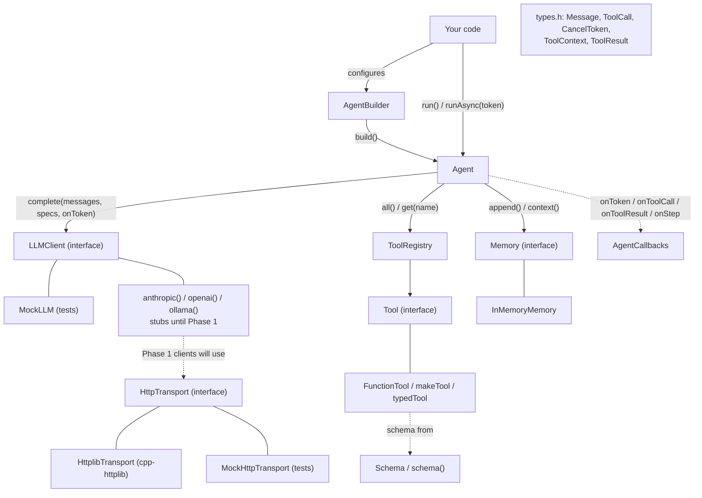

# corvus architecture

*The "why" of the codebase: what corvus is, how its parts fit together, and the reasoning behind the
shape. For "where is X and what does each function do", read [CODE_TOUR.md](CODE_TOUR.md). For "how
did it get this way", read [HISTORY.md](HISTORY.md). Start at the [docs index](README.md) if you're
new.*

---

## 1. What corvus is, and who it's for

corvus is an **in-process, offline-capable, low-latency AI agent runtime for C++17**. An "agent"
here is a loop: send a task to a language model, let the model ask for tools (functions you
wrote), run them, feed the results back, and repeat until the model gives a final answer.

Python has LangChain and friends for this. C++ has had nothing comparable. The usual workarounds
are to embed a Python interpreter, run a sidecar process, or hand-write HTTP calls against a
provider API. corvus is aimed at programs where those workarounds hurt most:

| Domain | Why Python-based agents don't fit |
|---|---|
| ROS2 robotics | Nodes are C++; a blocking call stalls the spin loop |
| Game engines (Unreal) | Game thread can't wait on a network round-trip |
| Edge / embedded (RPi, Jetson, drones) | No room for a Python runtime; must run offline |
| HFT / low-latency | Latency and determinism budgets rule out interpreters |

The **working name** is `corvus` (namespace `corvus`, `#include <corvus/corvus.h>`, CMake target
`corvus::corvus`). The final public name is still undecided. "Jarvis", the repo folder name, is
reserved for a later demo assistant built *on top of* the library.

### The three differentiators

Everything in the design serves one of these:

1. **MCP-native.** The [Model Context Protocol](https://modelcontextprotocol.io) has thousands of
   existing tool servers. A native MCP client (Phase 3) means corvus has a tool ecosystem on day
   one, without the maintainers writing each integration.
2. **Native tool-calling, not prompt parsing.** Cloud providers return structured JSON tool calls;
   local llama.cpp models are forced into valid JSON with GBNF grammars (Phase 2). Parsing
   "Action: …" out of free text (ReAct) is only a fallback.
3. **Async + streaming + cancellation.** `runAsync` returns a `std::future`, tokens stream through a
   callback, and a `CancelToken` stops a run cooperatively. A robot or game can't afford a blocking
   loop.

---

## 2. Component map



The value types in `types.h` are used by nearly every box and are left out of the arrows for
readability.

How to read it:

- **Solid boxes with "(interface)"** are the seams. Each has at least two implementations, or will
  soon: a real one and a test double.
- **`Agent` is the only unit that knows about all the others.** Tools don't know about memory,
  memory doesn't know about models, and the transport doesn't know about any provider.
- **Dependency direction is one-way.** Everything depends *down* onto `types.h`; nothing in `types.h`
  depends on anything else in corvus.

---

## 3. Why the repository is laid out this way

```
include/corvus/   public headers — the STABLE CONTRACT
src/              implementations — free to change
tests/            doctest suite — offline, deterministic
examples/         runnable demos (mock_quickstart)
cmake/            package-config template for find_package(corvus)
docs/             this guide, specs, plans, history
.github/workflows CI: 3-OS build matrix + sanitizers
```

**Public headers are a contract.** Anything in `include/corvus/` is what users compile against.
Changing a signature there breaks every downstream project, so headers change rarely and
deliberately. Two rules follow from that:

- **Dependency-light.** Public headers include only the C++ standard library and each other. No
  third-party headers ever appear there. cpp-httplib and nlohmann/json are compiled `PRIVATE` into
  the library (`CMakeLists.txt` puts their include paths on the `PRIVATE` side), so swapping HTTP
  libraries later can't change what user code sees.
- **Leaf-first includes.** `types.h` holds the shared value types, so `tool.h`, `memory.h`, and
  `llm_client.h` never need to include each other. This removed a real circular-include problem
  during the Phase 0 hardening.

**Implementation hides in `src/`.** Classes nobody outside needs, such as `HttplibTransport` and
the `RunningGuard` helper, live in anonymous namespaces inside `.cpp` files. They aren't part of
the API and can be rewritten freely.

**Two ways to consume the library, both supported:**

- `FetchContent` / `add_subdirectory`: you get the `corvus::corvus` alias target. Tests are **off**
  for you, because they only default on when corvus is the top-level project.
- `find_package(corvus)` after `cmake --install`: the generated `corvusConfig.cmake` re-finds
  Threads (and OpenSSL if corvus was built with TLS) for you.

**Tests never touch the network.** A scripted `MockLLM` plays the model and a scripted
`MockHttpTransport` plays the network. CI can run on any machine, with no API keys, and the same
input always gives the same output.

---

## 4. Design patterns, and the problem each one solves here

Each pattern is here because it solves a concrete problem in this codebase, not for decoration.

| Pattern | Where | The concrete problem it solves |
|---|---|---|
| **Strategy** | `LLMClient`, `Memory`, `HttpTransport`, `Strategy` enum | Swap the model backend, the memory policy, or the network layer without touching the agent loop. A Raspberry Pi build uses a local model; a server build uses Anthropic; the loop code is identical. |
| **Builder** | `AgentBuilder` | An `Agent` needs up to six collaborators, most optional. The builder gives readable call sites, defaults for what you leave out, and a single place to validate (`build()` throws with a clear message instead of `run()` crashing later). |
| **Command** | `Tool` (`execute(args, ctx)`) | A tool call from the model is a request object: name + JSON args. Packaging "an action you can invoke later with arguments" behind one interface lets built-in, user, and MCP tools be treated identically. |
| **Registry** | `ToolRegistry` | The model names tools by string. We need a thread-safe name → tool lookup, with a rule against one tool silently replacing another (anti-shadowing). |
| **Observer** | `AgentCallbacks` | Callers want to stream tokens, log tool calls, or trace iterations without the loop knowing about their UI, logger, or ROS topic. Optional callbacks are the lightest hook. |
| **Template Method** | `Agent::runImpl` | The loop skeleton (check cancel → ask model → run tools → record) is fixed; the varying steps are delegated to the pluggable `LLMClient`, `Tool`, and `Memory`. |
| **Seam + Test Double** | `LLMClient`/`MockLLM`, `HttpTransport`/`MockHttpTransport` | The only way to test network code offline is to cut the stack at an interface and inject a scripted fake. PR1 cut at raw HTTP bytes because HTTP semantics are stable while provider formats churn. |
| **RAII guard** | `RunningGuard` in `agent.cpp` | "One run at a time" must be released on *every* exit path: normal return, cancel, or exception. A destructor does this reliably; manual cleanup would miss some paths. |
| **Handle / shared state** | `Agent` → `shared_ptr<State>` | `runAsync` must stay valid even if the caller destroys the `Agent` mid-run. The future's task holds its own `shared_ptr` to the state, so the state lives as long as the run does. |

For the exact file and line of each pattern, see
[CODE_TOUR Appendix B](CODE_TOUR.md#appendix-b--design-patterns--code-locations).

---

## 5. Core invariants (rules that must never break)

| Invariant | Why it matters | Enforced by |
|---|---|---|
| **Tools never throw.** Failure is a `ToolResult` with a status. | An exception escaping a tool would unwind the whole agent loop mid-conversation. The typed status lets the loop decide retry-vs-give-up; the model sees `"ERROR: …"` text. | `FunctionTool::execute` try/catch (for `makeTool` and `typedTool` tools); convention for hand-written `Tool` subclasses; tests in `test_schema.cpp` |
| **Blocking tools honor `ToolContext`.** | C++ can't kill a thread. A tool that ignores cancel/deadline can only be abandoned, never stopped. | Convention (documented in `tool.h`); the watchdog arrives with the per-tool-timeout PR |
| **One run at a time per `Agent`.** | Two concurrent runs would interleave messages in the shared memory, producing a transcript no provider accepts. | `RunningGuard` throws `std::logic_error`; test "overlapping runs on one agent throw logic_error" |
| **The future owns the run state.** | Destroying or moving an `Agent` mid-`runAsync` must not crash. | `runAsync` captures `shared_ptr<State>` by value; test "destroying the Agent mid-run is safe" |
| **The transcript round-trips provider wire formats.** | Anthropic/OpenAI reject a tool result whose request isn't in the history. | Loop always appends the assistant turn *with* `toolCalls`, and each tool turn carries `toolCallId`; two tests pin this |
| **No silent tool shadowing.** | A malicious or misconfigured tool registered under a trusted tool's name would hijack its calls. | `registerTool` throws on duplicates unless `OverwritePolicy::Replace` |
| **`HttpTransport::post` never throws.** | Retry logic branches on values (`status`, `error`), not on exception types. | Response body capped at 64 MB (no `bad_alloc`); all failures mapped to `status == 0` + `error` |
| **Tests are offline and deterministic.** | CI must run anywhere, free, reproducibly. | Only mocks in the test path; real-transport tests fail *before* connecting |
| **Public headers stay dependency-light.** | Users shouldn't inherit our third-party libraries. | `PRIVATE` include dirs in CMake; review |

---

## 6. Decisions: settled vs still open

Full reasoning lives in [CLAUDE.md](../CLAUDE.md) (section "Open / parked decisions") and the specs.
One line each here:

**Settled**
- Tool contract: `execute(args, ctx) -> ToolResult` (hardening spec A2).
- Memory: unbounded by default; bounding comes from opt-in *view* policies (the store keeps, the
  policy decides what's sent) that trim in batches so provider prompt caching keeps working. The
  system prompt is agent config, not memory. Memory only ever receives complete exchanges, and an
  always-on backstop handles context overflow on the outgoing request
  ([memory spec v2](specs/2026-07-04-memory-design.md)).
- HTTP seam cut at raw bytes, not provider events
  ([cloud clients spec](specs/2026-07-15-cloud-clients-design.md)).
- Built-in tools ship by risk: Calculator + guarded HttpRequest (P1), jailed file I/O (P2), guarded
  shell (P4). WebSearch comes via MCP, not as an owned integration.
- `ToolGuard` (is *this call* safe?) is separate from `ToolPolicy`/RBAC (may *this agent* use this
  tool?). The guard ships early; RBAC ships in Phase 4.

**Still open**
- Final library name (renaming later is a find-and-replace sweep).
- Extension model: MCP-only, or also in-process plugins (which would need a pure C ABI).
- Schema builder: keep the hand-rolled JSON writer or move to nlohmann/json now that it's a dependency.
- Async execution: `std::async` today; a thread pool only if profiling proves it's needed.

---

## 7. Where the roadmap plugs in

Every future phase extends an existing seam instead of reshaping the core:

| Phase | What arrives | Seam it plugs into |
|---|---|---|
| 1 — cloud backends | `AnthropicClient`, `OpenAIClient`, retries, usage/cost | `LLMClient` (implementations) on top of `HttpTransport` |
| 1 | Per-tool timeout | `ToolContext::deadline` (already in the type, unset today) + a loop watchdog |
| 1 | Atomic exchange commits (`Memory::appendAll`), `withSystemPrompt` | `Memory` (one additive method), `AgentBuilder` |
| 1 | `SqliteMemory` (sessions, versioned schema), `lastN` view policy, sanitizer, overflow backstop, `onContextTrim` | `Memory` + a view policy applied by the loop; `AgentCallbacks` |
| 1 | Calculator, guarded HttpRequest, `ToolGuard`, arg validation | `Tool` / `ToolRegistry` |
| 2 — local-first | Ollama, llama.cpp + GBNF, token-budget memory, jailed file tools | `LLMClient`, `Memory`, `Tool` |
| 3 — MCP-native | `McpClient`; MCP tools registered as `<server>__<tool>` | `Tool` / `ToolRegistry` (and anti-shadowing matters here) |
| 4 — multi-agent | Orchestrator, EventBus, `PlanAndExecute`, `ToolPolicy`/RBAC | `Strategy`, and a layer *above* the registry |
| 5–6 | ROS2 / game demos, launch | Consumers of the public API |

The current per-PR plan for Phase 1 is the branch table in [CLAUDE.md](../CLAUDE.md#phase-1-branch-plan-dependency-order).
