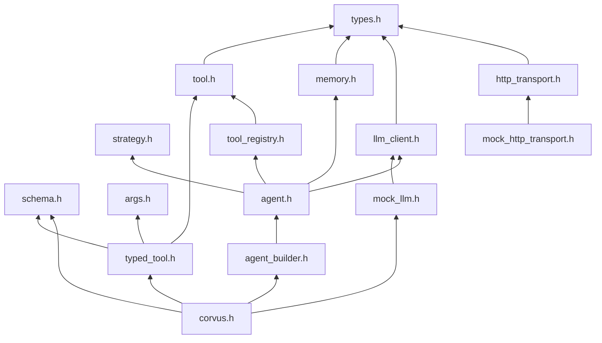
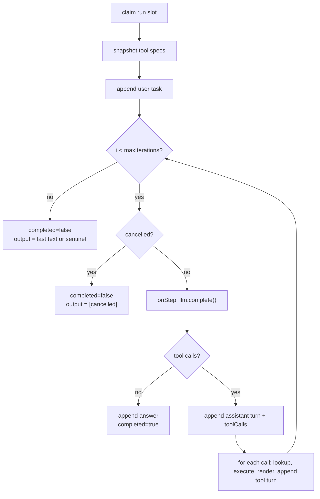
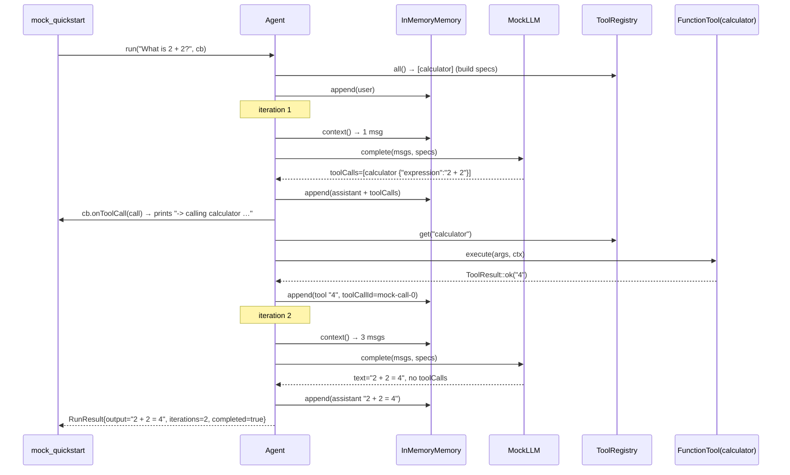

# corvus code tour

*A guided walk through every file in the repository: what it does, what each type and function
does, **why** it is written that way, what must never break, and which test would catch it. Read
[ARCHITECTURE.md](ARCHITECTURE.md) first for the big picture. Line links point at `main` as of the
last update to this file; if a link is off by a few lines, the symbol name is authoritative.*

---

## Part 0 — How to read this

**Reading order: bottom of the include graph, upward.** Each part only uses things introduced in
earlier parts, so you never meet a type before it's explained.



**Every file entry follows the same template:**

- **Role:** what the file owns, and what it deliberately does *not* own.
- **Walkthrough:** a table of each type/function, with *what* it does and *why* it's that way.
- **Invariants:** rules that must hold, and what enforces each.
- **Sharp edges:** behavior that could surprise you, tagged *intended*, *known gap → PR*, or *fixed*.
- **Tests that pin it:** the `TEST_CASE`s that fail if the invariants break.
- **If you change this file:** what else has to change with it.

**Glossary**

| Term | Meaning |
|---|---|
| Turn | One `Message` in the conversation (user, assistant, or tool). |
| Iteration | One pass of the agent loop: one model call plus the tools it asked for. |
| Observation | The text a tool's result becomes when shown to the model. |
| Tool spec | A tool's name, description, and JSON Schema, as handed to the model. |
| Seam | An interface where a real implementation can be swapped for a fake. |
| Test double | The fake used at a seam (`MockLLM`, `MockHttpTransport`). |
| Handle | A cheap object that points at shared state (`Agent` is one). |

---

## Part 1 — Vocabulary

### `include/corvus/types.h` · 73 lines · since hardening (July 2026)

**Role.** The shared value types that nearly every other header needs. It sits at the bottom of the
include graph on purpose: before it existed, `ToolCall` lived in `llm_client.h`, which included
`memory.h`, which needed `Message`, and the headers began including each other in a cycle. Moving
all plain data into one leaf header broke that cycle. This file has **no behavior** beyond trivial
helpers.

**Walkthrough**

| Symbol | What | Why |
|---|---|---|
| [`ToolCall`](../include/corvus/types.h#L17) | `{id, name, arguments}`: one tool the model asked to run. | `id` is assigned by the provider and **must be echoed back** with the result. `arguments` stays a raw JSON *string* here; the loop never parses it. A tool that wants typed values parses it with `Args` (Part 2; typed tools do this for you). Loop-level validation for every tool arrives with `feat/arg-validation`. |
| [`Message`](../include/corvus/types.h#L26) | One conversation turn: `role`, `content`, plus `name`/`toolCallId` (tool turns) and `toolCalls` (assistant turns). | Carries enough to rebuild the exact wire format Anthropic/OpenAI expect. Both providers require (a) the assistant turn that *requested* tools to stay in history with its calls, and (b) each tool result to name the request it answers. Without these fields, a Phase 1 client could not replay memory to a real API. |
| [`CancelToken`](../include/corvus/types.h#L36) | `cancel()` / `cancelled()` over a `shared_ptr<atomic<bool>>`. | **Copies share one flag.** You keep one copy, hand another to `runAsync`, and calling `cancel()` on yours is seen by the worker thread. The atomic makes cross-thread reads/writes safe without a lock. It's *cooperative*: the token only signals, and code must check it. |
| [`ToolContext`](../include/corvus/types.h#L49) | `{cancel, deadline}` + [`expired()`](../include/corvus/types.h#L53). | Handed to every tool call. A default-constructed `time_point` (zero) means "no deadline", so `expired()` returns false. Exists because **C++ cannot force-stop a thread**: the only way to bound a tool is for the tool to poll these. |
| [`ToolResult`](../include/corvus/types.h#L62) | `Status {Ok, RetryableError, FatalError, Timeout, Cancelled}` + `content`; factories `ok`, `retryable`, `fatal`. | Two audiences: the **loop** branches on `status` (retry vs give up), and the **model** only ever sees `content` rendered as text. Before this, tools returned `"ERROR: ..."` strings, and a tool whose normal output began with "ERROR:" was misread. |

**Example: the four turns of one tool round-trip, as stored in memory**

| # | role | content | toolCalls | name | toolCallId |
|---|---|---|---|---|---|
| 1 | user | "What is 2 + 2?" | — | — | — |
| 2 | assistant | "" | `[{id:"mock-call-0", name:"calculator", arguments:"{\"expression\":\"2 + 2\"}"}]` | — | — |
| 3 | tool | "4" | — | calculator | mock-call-0 |
| 4 | assistant | "2 + 2 = 4" | — | — | — |

**Invariants**
- Header includes only the standard library (enforced by review).
- `CancelToken` copies always share state (the member initializer allocates the flag once, and copying copies the `shared_ptr`).

**Sharp edges**
- `Timeout` and `Cancelled` have no factory function yet; build them as `ToolResult{ToolResult::Status::Timeout, "..."}`. *Known gap → `feat/per-tool-timeout`.*
- A `CancelToken` can't be reset. Once cancelled, it stays cancelled; use a fresh token per run. *Intended.*

**Tests that pin it:** "memory records the assistant tool-call turn and pairs results by id",
"assistant tool-call turn is recorded even when its text is empty", "runAsync returns a future and
honors a pre-cancelled token".

**If you change this file:** it's included by almost everything, so a change recompiles the world
and breaks users. Treat any field change as a breaking API change.

---

### `include/corvus/strategy.h` · 12 lines · since Phase 0

**Role.** Names the reasoning strategy the agent uses.

| Symbol | What | Why |
|---|---|---|
| [`Strategy`](../include/corvus/strategy.h#L10) | `enum class { ToolCalling, ReAct, PlanAndExecute }` | An enum, not a string, so a typo is a compile error instead of a silent runtime bug. All three names are declared now so the public API doesn't change when the strategies arrive. |

**Sharp edges**
- Only `ToolCalling` is implemented. `AgentBuilder::build()` rejects the others with *"only
  Strategy::ToolCalling is implemented; ReAct and PlanAndExecute are not available yet"*.
  *Intended:* accepting them and silently running ToolCalling (the Phase 0 behavior) hid the problem.
  (Message *fixed* in PR #2; it used to promise ReAct "in Phase 1", which no Phase 1 branch delivers.)

---

## Part 2 — The hands (tools)

### `include/corvus/tool.h` · 104 lines · since Phase 0, contract v2 since hardening

**Role.** The single extension contract. Built-in tools, your own C++ tools, and (Phase 3) MCP
tools all implement `Tool`, live in one registry, and are treated identically by the loop.

**Walkthrough**

| Symbol | What | Why |
|---|---|---|
| [`Tool`](../include/corvus/tool.h#L23) | Abstract base: `name`, `description`, `inputSchema`, `execute`. | One interface = one code path in the loop for every tool source. |
| [`name()`](../include/corvus/tool.h#L28) | Unique name the model uses to call the tool. | It's the registry key and the string the model emits. |
| [`description()`](../include/corvus/tool.h#L32) | What the tool does, for the model. | **The model decides whether to call your tool based on this text.** A vague description means the tool never gets used. |
| [`inputSchema()`](../include/corvus/tool.h#L35) | JSON Schema of the args object; default `"{}"`. | Sent to the model in the tool spec so it produces correctly shaped arguments. |
| [`execute(args, ctx)`](../include/corvus/tool.h#L38) | Runs the tool. **Must never throw.** | See invariants. |
| [`FunctionTool`](../include/corvus/tool.h#L49) | A `Tool` wrapping a `std::function`. | So a simple tool needs no subclass. |
| [`FunctionTool::execute`](../include/corvus/tool.h#L64) | Calls the function inside `try/catch`; `std::exception` → `fatal(e.what())`, anything else → `fatal("unknown exception in tool")`. | **Enforces never-throw for lambda authors**, who can't be trusted to remember. |
| [`makeTool` (full form)](../include/corvus/tool.h#L86) | `(name, desc, schema, ToolResult(args, ctx))` | For tools that report retryable errors or honor cancel/deadline. |
| [`makeTool` (simple form)](../include/corvus/tool.h#L94) | `(name, desc, schema, string(args))`; the return value is wrapped in `ToolResult::ok`. | The 90% case: string in, string out, no ceremony. |

**How C++ picks between the two `makeTool` overloads.** A lambda isn't a `std::function`, so the
compiler checks which `std::function` it can convert to. A lambda taking `(const std::string&)`
converts only to `SimpleFn`, and one taking `(const std::string&, const ToolContext&)` converts only
to `Fn`, so exactly one overload is viable. Always spell the lambda's return type
(`-> std::string` or `-> ToolResult`) so the intent is obvious to readers.

**Invariants**
- `execute` never throws. *Enforced* for `FunctionTool`; *convention only* for hand-written subclasses.
- Blocking tools poll `ctx.cancel.cancelled()` / `ctx.expired()`. *Convention only.* A tool that
  doesn't can only be abandoned on timeout, never stopped.

**Sharp edges**
- In the simple form, a thrown exception still becomes a *fatal* result, because `FunctionTool`
  catches it. There's no way to signal "retryable" from the simple form; use the full form. *Intended.*
- The simple form discards `ctx`, so a simple-form tool can't observe cancellation. *Intended*; use the full form for anything that blocks.

**Tests that pin it:** `test_schema.cpp`: "makeTool exposes name, description and schema",
"simple-form makeTool wraps the return value in an Ok result", "FunctionTool enforces the never-throw
contract", "full-form makeTool passes the context through".

**If you change this file:** update CONTRIBUTING.md's "Add a tool" section and this entry.

---

### `include/corvus/schema.h` + `src/schema.cpp` · 56 + 81 lines · since Phase 0

**Role.** A small fluent builder that writes the JSON Schema for a tool's arguments, so authors
never hand-write JSON. It deliberately covers only flat parameter lists.

**Walkthrough**

| Symbol | What | Why |
|---|---|---|
| [`Schema::str/num/integer/boolean`](../include/corvus/schema.h#L16) | Add a field `(name, description, required = true)`; each returns `*this`. | Returning `*this` is what makes chaining (`.str(...).num(...)`) work. Most tool args are required, hence the default. |
| [`Schema::json()`](../include/corvus/schema.h#L32) → [impl](../src/schema.cpp#L48) | Emits `{"type":"object","properties":{…},"required":[…]}`. | That's the exact shape both Anthropic and OpenAI accept for tool parameters. |
| `operator std::string()` | Implicit conversion to the JSON text. | Lets `schema().str(...)` be passed straight to `makeTool`'s `std::string schema` parameter. |
| [`schema()`](../include/corvus/schema.h#L54) | Free function returning an empty `Schema`. | Reads nicer than `Schema()` at the start of a chain. |
| [`escape()`](../src/schema.cpp#L10) (anonymous namespace) | JSON-escapes `"` `\` `\n` `\t` `\r`, and every other byte below 0x20 as `\u00XX`. | An unescaped control character makes the JSON invalid, and the provider rejects the whole request. (Hardening B7 fixed this; earlier versions only escaped quotes.) |

**Example**

```cpp
corvus::schema().str("city", "city name").num("days", "forecast length", false)
// → {"type":"object","properties":{"city":{"type":"string","description":"city name"},
//    "days":{"type":"number","description":"forecast length"}},"required":["city"]}
```

**Sharp edges**
- Flat only: no nested objects, arrays, or enums. *Known gap*; open decision 4 is whether to move
  to nlohmann/json now that it's a dependency.
- Adding the same field name twice emits it twice. *Intended for now* (garbage in, garbage out).
- Non-ASCII UTF-8 passes through unchanged, which is valid JSON. *Intended.*

**Tests that pin it:** "schema builds a JSON Schema object with a required array", "schema escapes
quotes in descriptions", "schema escapes control characters so the JSON stays valid".

---

### `include/corvus/args.h` + `src/args.cpp` · 54 + 110 lines · since `feat/typed-tools`

**Role.** A read-only view over a tool call's arguments, parsed from the JSON object text the model
sent. It lets tool authors read typed values without bringing their own JSON library. It does
**not** validate against a schema; that is `feat/arg-validation`'s job (which should reuse this).

**Walkthrough**

| Symbol | What | Why |
|---|---|---|
| [`Args::parse(text, error)`](../include/corvus/args.h#L26) → [impl](../src/args.cpp#L20) | `std::optional<Args>`; nullopt for invalid JSON or a non-object top level, with a short reason in `*error`. Blank text parses as `{}`. | A no-arg tool call often arrives as an empty string. The reasons are written for the model, which receives them as `ERROR: invalid arguments: …`. |
| [`has(key)`](../include/corvus/args.h#L35) | Present **and not null**. | Models often send `null` for an optional field they don't want to set. |
| [`getString/getNumber/getInteger/getBool`](../include/corvus/args.h#L37) | Each returns `std::optional`; nullopt on absent, null, or the wrong JSON type. | Strict: `"5"` is not a number, `1` is not a boolean. Silent coercion hides model mistakes. |
| [`getInteger`](../src/args.cpp#L75) | JSON integers in `int64` range, plus floats that are exactly integral (`3.0`). | Some providers serialise every number as a float. `3.5`, `1e300` and `2^63` are rejected. |
| `Args::Impl` (in the .cpp) | Holds the `nlohmann::json` object. | Pimpl keeps the third-party header out of `include/corvus/` (the dependency is linked PRIVATE). That is also why `Args` is move-only. |

**Sharp edges**
- Unsigned values above `INT64_MAX` are rejected by `getInteger`. *Intended* (rare for tool args).
- Nested objects and arrays have no getter. *Known gap*, matching the flat `Schema`.

**Tests that pin it:** `test_args.cpp` (all 6 cases).

---

### `include/corvus/typed_tool.h` · 243 lines · since `feat/typed-tools`

**Role.** Build a tool whose arguments arrive as a C++ struct. Each `field()` call records one
member's schema entry **and** how to read it, so the schema the model sees and the parsing cannot
drift apart. Header-only template; it touches JSON only through `Args`.

```cpp
struct MoveArgs { double x = 0; double y = 0; std::string frame = "map"; };

auto move = corvus::typedTool<MoveArgs>("move_to", "Move the robot to (x, y)")
    .field("x", &MoveArgs::x, "target x in metres")
    .field("y", &MoveArgs::y, "target y in metres")
    .field("frame", &MoveArgs::frame, "TF frame", corvus::Optional)
    .run([&](const MoveArgs& a) { return robot.moveTo(a.x, a.y, a.frame); });
```

**Walkthrough**

| Symbol | What | Why |
|---|---|---|
| [`Requiredness`](../include/corvus/typed_tool.h#L23) + `corvus::Required` / `corvus::Optional` | Whether the model must supply a field. | Reads better at the call site than the bare `bool` that `Schema` takes. |
| [`typedTool<T>(name, desc)`](../include/corvus/typed_tool.h#L239) | Returns a `TypedToolBuilder<T>`. `T` must be default-constructible (`static_assert`). | Each call starts from `T{}`, so absent optional fields keep the struct's default initializers. |
| [`field(key, &T::m, desc, req = Required)`](../include/corvus/typed_tool.h#L134) | Deduces the JSON type from the member type: `std::string`→string, `bool`→boolean, integers→integer, floating point→number, `std::optional<U>`→`U`'s type and always optional. Any other type is a compile error. Empty or duplicate keys throw `invalid_argument`. | Pointer-to-member keeps the struct as the single source of truth without macros. A macro couldn't carry per-field descriptions, and descriptions are what the model reads. |
| [`detail::readField`](../include/corvus/typed_tool.h#L57) | Reads one present value into the member; integers are range-checked into the member type (`int8_t` takes only `[-128, 127]`). | Silent narrowing of model input would be a bug the tool can't see. |
| [`inputSchema()`](../include/corvus/typed_tool.h#L185) | The JSON Schema built so far. | Handy for tests and debugging; the built tool reports the same text. |
| [`run(fn)`](../include/corvus/typed_tool.h#L192) | Returns a `ToolPtr` built on the full-form `makeTool`. `fn` is `std::string(const T&)` (→ `Ok`) or `ToolResult(const T&, const ToolContext&)` (returned as-is). | The two forms mirror `makeTool`'s. Bad args become `RetryableError("invalid arguments: <why>")`, naming the field, so the model can fix them next turn. |

**Invariants**
- Schema entries and binders come from the same `field()` call, in declaration order.
- `execute` never throws: arg errors are retryable results, and exceptions from `fn` are turned
  into `FatalError` by `FunctionTool::execute`.
- No third-party header is included (nlohmann is linked PRIVATE, so including it would not build
  for consumers).

**Sharp edges**
- Unknown keys are ignored. *Intended* (lenient); strict rejection, if wanted, belongs to
  `feat/arg-validation`.
- Flat fields only (no nested structs, vectors, or enums). *Known gap*, same as `Schema`.
- A pointer to a *base-class* member (`&Base::x` for `typedTool<Derived>`) doesn't deduce. *Intended
  for now*; register on the base struct instead.

**Tests that pin it:** `test_typed_tool.cpp` (all 10 cases), including "typedTool schema equals the
equivalent hand-written schema" and the end-to-end agent-loop case.

**If you change this file:** keep the type-mapping table in the
[typed tools spec](specs/2026-10-06-typed-tools-design.md) and this entry in sync.

---

### `include/corvus/tool_registry.h` + `src/tool_registry.cpp` · 41 + 47 lines · since Phase 0

**Role.** The thread-safe toolbox: name → tool. It is deliberately "dumb": no permissions, no
per-agent views. Access control goes in a layer *above* it in Phase 4 (decision 8).

**Walkthrough**

| Symbol | What | Why |
|---|---|---|
| [`OverwritePolicy`](../include/corvus/tool_registry.h#L15) | `{Error, Replace}`. | Makes replacing a tool an **explicit** choice. |
| [`registerTool(tool, policy = Error)`](../include/corvus/tool_registry.h#L25) → [impl](../src/tool_registry.cpp#L7) | Throws `invalid_argument` on null, or on a duplicate name under `Error`. | **Anti-shadowing:** if a second tool could silently take the name `"read_file"`, a malicious MCP server could hijack every call meant for the trusted one. |
| [`get(name)`](../include/corvus/tool_registry.h#L28) | The tool, or `nullptr`. | Returning null instead of throwing lets the loop turn "model asked for a tool that doesn't exist" into a normal error observation. |
| [`has(name)`](../include/corvus/tool_registry.h#L29) | Membership test. | Convenience. |
| [`all()`](../include/corvus/tool_registry.h#L31) | A snapshot `vector` of all tools, sorted by name. | A copy so callers iterate without holding the lock. Sorted because the backing store is `std::map`, which makes the tool-spec order sent to the model **deterministic** (reproducible tests, stable prompts). |
| [`size()`](../include/corvus/tool_registry.h#L32) | Count. | Convenience. |

**Invariants**
- Every member locks the one `mutex_`, so all calls are thread-safe.
- A name maps to at most one tool, and changes only via `Replace`.

**Tests that pin it:** `test_registry.cpp` (all 4 cases), plus "repeated build() with a shared
registry keeps anti-shadowing".

---

## Part 3 — Recall (memory)

### `include/corvus/memory.h` + `src/memory.cpp` · 44 + 22 lines · since Phase 0

**Role.** The conversation history. LLMs are **stateless**: each call must resend the whole
conversation, and `Memory` is what holds it between calls.

**Walkthrough**

| Symbol | What | Why |
|---|---|---|
| [`Memory`](../include/corvus/memory.h#L15) | Interface: `append`, `context`, `clear`. | A seam: persistent (`SqliteMemory`), bounded (`lastN`, `maxTokens`), and summarizing memories all slot in here without touching the loop. |
| [`context()`](../include/corvus/memory.h#L21) | Returns the messages **by value** (a copy). | The caller gets a consistent snapshot, even if another thread appends meanwhile. Future policies (trimming) apply *here*: `context()` returns what should be sent, which may be less than what's stored. |
| [`InMemoryMemory`](../include/corvus/memory.h#L30) → [impl](../src/memory.cpp) | A `vector<Message>` behind a mutex. | Simplest correct default. |
| [`inMemory()`](../include/corvus/memory.h#L42) | Factory returning a fresh `InMemoryMemory`. | Keeps call sites short and hides the concrete type. |

**Sharp edges**
- Unbounded: a long conversation eventually exceeds the model's context window. *Known gap →
  `feat/memory-trim-backstop`* (the batched `lastN` view policy, the transcript sanitizer, and the
  always-on overflow backstop; see the [memory spec](specs/2026-07-04-memory-design.md)).
- Not atomic per exchange: the loop appends the user task before calling the model and each tool
  result as it arrives. Harmless while `complete()` can't throw (Phase 0), but once real clients
  can fail mid-run it would leave an unanswered task or orphaned `toolCalls` behind. *Known gap →
  `feat/anthropic-client`* (buffer the exchange, commit via a new `Memory::appendAll`; memory spec §6).
- No system prompt yet. When it arrives it is **agent configuration** (`withSystemPrompt`),
  prepended to each request and never stored here (memory spec §4.1).
- `context()` copies the whole history on every loop iteration (O(history) per turn). *Intended*,
  and cheap next to a network round-trip; revisit only if profiling says so.
- Memory is **per agent, and persists across runs**: a second `run()` on the same agent sees the
  first conversation. That's what makes follow-up questions work. For a clean slate, call `clear()`
  or build a new agent.

---

## Part 4 — The brain seam (model backends)

### `include/corvus/llm_client.h` · 52 lines · since Phase 0

**Role.** The abstraction over every model backend: Anthropic, OpenAI, Ollama, llama.cpp, and the mock.

| Symbol | What | Why |
|---|---|---|
| [`LLMResponse`](../include/corvus/llm_client.h#L13) | `{text, toolCalls}`. Empty `toolCalls` means `text` is the final answer. | This is the "native tool calling" shape: the model returns structured calls, and we never parse intent out of prose. Both fields can be set at once (models often narrate, then act). |
| [`ToolSpec`](../include/corvus/llm_client.h#L19) | `{name, description, parametersJson}`. | What the model is shown about each tool; built by the loop from the registry. |
| [`TokenCallback`](../include/corvus/llm_client.h#L26) | `void(const std::string& chunk)`. | The streaming hook; `AgentCallbacks::onToken` is passed straight through to it. |
| [`LLMClient::complete`](../include/corvus/llm_client.h#L39) | One model turn: `(messages, tools, onToken) -> LLMResponse`. | Stateless by design; history comes in via `messages` every time. |
| [`anthropic()` / `openai()` / `ollama()`](../include/corvus/llm_client.h#L48) | Factory functions. | Declared in Phase 0 so the quickstart's shape is stable from day one. |

### `src/clients_stub.cpp` · 22 lines

The three factories [throw `std::runtime_error`](../src/clients_stub.cpp#L10) with *"… lands in
Phase 1 — use MockLLM for now"*. **Why stub instead of omit:** the library links, the README's
quickstart compiles, and the failure is a clear message rather than a linker error. Replaced by
`feat/anthropic-client` and `feat/openai-client`.

### `include/corvus/mock_llm.h` + `src/mock_llm.cpp` · 44 + 48 lines · since Phase 0

**Role.** A scripted fake model: the backbone of the offline test suite and the quickstart example.

| Symbol | What | Why |
|---|---|---|
| [`reply(text)`](../include/corvus/mock_llm.h#L23) | Queue a final answer. | |
| [`callTool(name, argsJson)`](../include/corvus/mock_llm.h#L26) | Queue a turn requesting one tool. | |
| [`replyAndCallTool(text, name, argsJson)`](../include/corvus/mock_llm.h#L30) | Queue text *and* a tool call. | Lets tests cover "model narrates before acting" (e.g. the early-stop text path). |
| [`complete(...)`](../include/corvus/mock_llm.h#L35) → [impl](../src/mock_llm.cpp#L29) | Pops the next queued turn; ignores `messages`/`tools`; sends the whole text to `onToken` as **one** chunk. | Determinism: the same script always gives the same run. |
| `nextId_` | Counter behind the ids `"mock-call-0"`, `"mock-call-1"`, … | Unique ids let tests check that results are paired with requests. |

All three queueing methods return `MockLLM&`, so scripts chain:
`mock->callTool("calc", "{}").reply("done")`.

**Sharp edges**
- Empty queue → returns the text `"[MockLLM] no queued response"` instead of throwing. *Intended*
  (a real backend always answers something), but an under-scripted test "passes" with that text as
  output, so assert on `output`.
- Doesn't record what it was sent (unlike `MockHttpTransport::requests()`). Tests that need to see
  the messages use a small spy `LLMClient`; see "default memory is not shared between agents from
  one builder". *Candidate improvement.*
- Not thread-safe. Drive it from one run at a time.
- Ids used to be derived from the queue size and could repeat after consume/re-enqueue. *Fixed in
  PR #2* (test: "MockLLM tool-call ids stay unique across consume and re-enqueue").

---

## Part 5 — The wire (HTTP transport, PR #1)

**Why this layer exists.** Phase 1's cloud clients must do real HTTPS in production, but tests must
never touch the network. The fix is a seam, and PR #1 cut it at **raw HTTP bytes**:

- Clients above the seam own everything provider-specific: request JSON, the SSE streaming format,
  and error mapping.
- The transport below it just moves bytes.

Why cut there: HTTP semantics never change, while provider formats change often, and a contract
should sit on stable ground. The alternatives were rejected: a shared "provider event" layer
(Anthropic and OpenAI stream differently, so it would leak) and a localhost test server (real
sockets make CI flaky).

### `include/corvus/http_transport.h` · 66 lines

| Symbol | What | Why |
|---|---|---|
| [`HttpRequest`](../include/corvus/http_transport.h#L19) | `url`, `headers`, pre-serialized `body`, `connectTimeout` (10 s), `readTimeout` (120 s). | The read timeout is *per read*, and generous because a streaming model can pause between tokens. |
| [`HttpResponse`](../include/corvus/http_transport.h#L27) | `status`, `headers`, `body`, `error`. **`status == 0` means the network itself failed**, and then `error` says why. | Any real HTTP exchange, even a 500, returns its real status. Callers branch on values, never on exceptions. |
| [`ChunkCallback`](../include/corvus/http_transport.h#L41) | `bool(const char*, size_t)`. Returning `false` aborts the socket. | That one boolean is how "stop generating" reaches the network. |
| [`HttpTransport::post`](../include/corvus/http_transport.h#L53) | Blocking POST that never throws; checks `cancel` before sending and on every received buffer. | Never-throw because retry logic (PR 4) wants to inspect a value. Cancel on every buffer so a cancel lands within one network read. |
| [`defaultHttpTransport()`](../include/corvus/http_transport.h#L64) | Returns the cpp-httplib implementation. | Hides the concrete class, so httplib stays out of public headers. |

**What ends up in `body`:**

| Call | 2xx | non-2xx |
|---|---|---|
| No `onChunk` (non-streamed) | Full body (capped at 64 MB) | Full body (capped) |
| With `onChunk` (streamed) | **Empty**; bytes went to `onChunk` | Error payload, capped at 256 KB; `onChunk` is **never** called |

Why the non-2xx case skips `onChunk`: the client's streaming parser expects SSE events, and a JSON
error body would confuse it. The client parses `body` instead.

### `src/httplib_transport.cpp` · 189 lines

All cpp-httplib code lives in this one file, in an anonymous namespace.

| Symbol | What | Why |
|---|---|---|
| [`kErrorBodyCap` / `kMaxBodyBytes`](../src/httplib_transport.cpp#L18) | 256 KB / 64 MB. | Bound memory. A hostile server declaring a huge body could otherwise cause `bad_alloc`, i.e. an exception escaping a never-throw function (found in PR #1 review). |
| [`splitUrl`](../src/httplib_transport.cpp#L32) | Splits into base + path. Accepts only `http://`/`https://`; rejects `@` and control/space characters in the authority. | **Userinfo attack:** `https://api.anthropic.com@evil.example/` actually connects to `evil.example`, and would send the API key there under a valid TLS certificate for the attacker's host. |
| [`hasCtl`](../src/httplib_transport.cpp#L28) | True if a string contains CR or LF. | **Header injection:** a `\r\n` in a header value would write extra headers, or a second request, onto the wire. httplib only checks this on a code path we don't use. Not exploitable today, but the Phase 1 HttpRequest *tool* will let model-influenced values reach here. |
| [`iequals`](../src/httplib_transport.cpp#L58) | Case-insensitive compare. | Header names are case-insensitive; used to detect a caller's `Content-Type`. |
| [`HttplibTransport::post`](../src/httplib_transport.cpp#L72) | The real request. | Steps below. |
| [`defaultHttpTransport()`](../src/httplib_transport.cpp#L187) | `make_shared<HttplibTransport>()`. | |

**`post` step by step**

1. Validate the URL (`splitUrl`). If it's bad: `error = "invalid url: …"`, status 0.
2. If the URL is `https` but corvus was built without OpenSSL, fail with a clear message instead of
   an opaque socket error.
3. **Pre-flight cancel:** if the token has already fired, return `"cancelled"` without connecting.
4. Configure the client: timeouts, and `set_follow_location(false)` (**no redirects**, so a
   key-bearing request can't be bounced to another host).
5. Copy headers, rejecting any with CR/LF; `Content-Type` defaults to `application/json` and can be
   overridden.
6. The `response_handler` records the status **before** any body byte arrives, which is what lets
   the next step route bytes by status.
7. The `content_receiver` gets each buffer:
   - check cancel first; if fired, return false, which closes the socket;
   - 2xx with `onChunk`: forward the buffer, and abort if `onChunk` returns false;
   - otherwise append to `bodyBuf` up to the cap; a non-streamed body that hits the cap stops with
     `"response body exceeded cap"`.
8. On failure, pick the error in order of precedence: `cancelled` > `aborted by receiver` >
   overflow > httplib's own error text. Status stays 0.
9. On success, copy the status and headers, and move `bodyBuf` into `body`.

Certificate and hostname verification are on by default in the pinned cpp-httplib (v0.18.3); this
was checked against the library source during review.

### `include/corvus/mock_http_transport.h` · 115 lines

**Role.** The scripted fake for `HttpTransport`. Header-only, since only tests use it.

| Symbol | What | Why |
|---|---|---|
| [`Script`](../include/corvus/mock_http_transport.h#L20) | `{response, chunks}`. Non-empty `chunks` means a streamed reply. | |
| [`enqueue(response)`](../include/corvus/mock_http_transport.h#L26) | Next call returns this response. | |
| [`enqueueStream(status, chunks, headers)`](../include/corvus/mock_http_transport.h#L29) | Next call streams these chunks, then reports `status`. | |
| [`onBeforeChunk`](../include/corvus/mock_http_transport.h#L39) | Hook called before chunk *i*. | Lets a test fire a cancel mid-stream at an exact point. |
| `requests()` | Every request seen, in order. | Lets client tests assert byte-for-byte what *would* have gone over the wire. |
| [`post`](../include/corvus/mock_http_transport.h#L44) | Mirrors every rule of the real transport. | See below. |

**The golden rule: the mock must behave exactly like the real transport.** If it drifts, the
offline tests start certifying behavior production doesn't have, and every Phase 1 client test
quietly becomes worthless. PR #1's review found exactly this kind of drift and fixed it.
Concretely, the mock mirrors:
- the pre-flight cancel check;
- normalization (an `enqueue`'d body with an `onChunk` present streams through `onChunk`);
- non-2xx replies never reaching `onChunk`;
- mid-stream `"cancelled"` and `"aborted by receiver"`;
- an empty `body` on streamed 2xx.

**Sharp edge:** not thread-safe. Drive it from the test thread. *Intended.*

### `tests/test_transport_contract.cpp` · 227 lines, 13 cases

Pins both transports to one contract. Mock tests cover FIFO order, request recording, an empty queue
(an error, not a throw), streaming order, collapse-to-body, non-2xx handling, receiver abort, and
pre-flight and mid-stream cancel. Real-transport tests exercise only the guards that fail **before
connecting** (malformed URL, userinfo, CR/LF header, pre-cancelled token), so the suite still never
touches the network.

**Sharp edge:** neither transport header is included by `corvus.h`. *Intended*: the transport is
plumbing for backend implementers, and `mock_http_transport.h` is a test utility. Include them
directly when you need them.

---

## Part 6 — The loop

### `include/corvus/agent.h` + `src/agent.cpp` · 82 + 173 lines

**Role.** The reasoning loop that ties model, tools, and memory together. This is the one unit that
knows about all the others.

**Public types**

| Symbol | What | Why |
|---|---|---|
| [`AgentCallbacks`](../include/corvus/agent.h#L19) | Optional `onToken`, `onToolCall`, `onToolResult(tool, observation)`, `onStep(iteration)`. | Observer pattern: stream to a UI, log, or trace without the loop knowing about any of them. `onStep` doubles as the tracing seam. |
| [`RunResult`](../include/corvus/agent.h#L27) | `output`, `iterations`, `completed`. | See the exit cases below. |
| [`Agent`](../include/corvus/agent.h#L45) | A **handle** to shared `State`. | Copying an `Agent` gives a second handle to the *same* agent and conversation, not a clone. |
| [`Agent(...)` constructor](../include/corvus/agent.h#L49) | Stores the collaborators in a fresh `State`. | Trusts its inputs; `AgentBuilder` does the validation. |
| [`run(task, callbacks)`](../include/corvus/agent.h#L55) → [impl](../src/agent.cpp#L58) | Blocking; runs on the caller's thread with a never-fired token. | Simplest usage. |
| [`runAsync(task, token, callbacks)`](../include/corvus/agent.h#L61) → [impl](../src/agent.cpp#L63) | Starts `runImpl` via `std::async(launch::async)`, returns the `future`. | Non-blocking for ROS2/game threads. |
| [`State`](../include/corvus/agent.h#L67) | llm, registry, memory, strategy, maxIterations, `atomic<bool> running`. | Kept in a `shared_ptr` so an in-flight run can own it. |

**Why `runAsync` copies everything into the lambda.** The lambda
[captures `state`, `task`, `token`, `callbacks` by value](../src/agent.cpp#L69). The run therefore
owns everything it touches: you can destroy or move the `Agent` object while the future is pending,
and nothing dangles. Capturing `this` would crash in exactly that case.

**Internal helpers (anonymous namespace)**

| Symbol | What | Why |
|---|---|---|
| [`RunningGuard`](../src/agent.cpp#L11) | Constructor does `running.exchange(true)` and throws `logic_error` if it was already true; destructor stores false. | Enforces **one run at a time**; RAII releases the slot on every exit path, including exceptions. `exchange` makes "check and claim" a single atomic step, with no race window. |
| [`renderObservation`](../src/agent.cpp#L31) | `Ok` → content as-is; `Timeout` → `"ERROR: tool timed out[: …]"`; `Cancelled` → `"ERROR: tool cancelled[: …]"`; retryable/fatal → `"ERROR: " + content`. | The status is for the loop; the model gets consistent text. |

**`runImpl`, step by step** ([source](../src/agent.cpp#L74))

1. **Claim the run slot** with `RunningGuard` ([L76](../src/agent.cpp#L76)). A concurrent run
   throws here; for `runAsync`, the exception surfaces at `future.get()`.
2. **Snapshot tool specs once** from `registry->all()`. The toolset is fixed for the run, so the
   model sees a consistent list and the work isn't redone each iteration.
3. **Append the user's task** to memory.
4. **Loop** up to `maxIterations` ([L98](../src/agent.cpp#L98)):
   1. **Cancelled?** → return `output = "[cancelled]"`, `completed = false`.
   2. Record `iterations = i + 1`; call `onStep`.
   3. **Ask the model:** `llm->complete(memory->context(), specs, onToken)` ([L111](../src/agent.cpp#L111)).
   4. **No tool calls → done** ([L114](../src/agent.cpp#L114)): append the assistant answer to
      memory, return `completed = true`.
   5. **Otherwise record the assistant turn *with* its `toolCalls`**, even if its text is empty
      ([L130](../src/agent.cpp#L130)). Providers reject a tool result whose request is missing from
      history. Non-empty text is kept as "best answer so far".
   6. **For each tool call:** `onToolCall` → build a `ToolContext` (with the run's cancel token) →
      look the tool up ([L146](../src/agent.cpp#L146)); if it's missing, use
      `fatal("unknown tool '…'")` so the model can correct itself → `execute` →
      `renderObservation` → `onToolResult` → append a `tool` turn carrying `toolCallId = call.id`
      ([L160](../src/agent.cpp#L160)).
5. **Cap reached** (the loop guard against runaway models): `completed = false`, and `output` is the
   last assistant text, or `"[stopped: reached maxIterations]"` if there was none
   ([L168](../src/agent.cpp#L168)).



**What `RunResult.output` holds**

| Exit | `completed` | `output` |
|---|---|---|
| Model gave a final answer | true | that answer |
| Hit `maxIterations` | false | last non-empty assistant text, else `"[stopped: reached maxIterations]"` |
| Cancelled | false | `"[cancelled]"` |

**Invariants:** one run at a time; the future owns the state; the transcript round-trips (see
[ARCHITECTURE §5](ARCHITECTURE.md#5-core-invariants-rules-that-must-never-break)).

**Sharp edges**

| Edge | Status |
|---|---|
| Cancel is checked only at the start of each iteration; it isn't passed into `llm->complete()`, so a slow model call runs to completion. | Known gap → `feat/anthropic-client` (cancel threaded into the client and transport) |
| `RetryableError` is treated exactly like `FatalError`; nothing retries. | Known gap → `feat/retries-backoff` |
| `ctx.deadline` is never set, so one hung tool freezes the run. | Known gap → `feat/per-tool-timeout` (the single most important gap for ROS2/game use) |
| Tool calls within one turn run sequentially. | Known gap → Phase 4 parallel execution |
| A cancel returns `"[cancelled]"` even if earlier assistant text existed. | Intended for now; could return best-so-far like the cap case |
| An exception thrown by `llm->complete()` propagates out of `run()` / `future.get()`. The guard still releases the slot. | Intended; Phase 1 clients define a typed `LLMError` |
| Callbacks from `runAsync` run on the worker thread. | Intended; make them thread-safe |

**Tests that pin it** (`test_agent.cpp`): "agent runs a tool call then returns the final answer",
"unknown tool yields an error observation but the loop continues", "max-iterations guard stops a
runaway loop", "early stop returns the last assistant text, not a sentinel", "memory records the
assistant tool-call turn and pairs results by id", "assistant tool-call turn is recorded even when
its text is empty", "full-form tool receives a context and typed errors reach the model as ERROR
text", "runAsync returns a future and honors a pre-cancelled token", "overlapping runs on one agent
throw logic_error", "destroying the Agent mid-run is safe; the future completes", "sequential
runAsync calls on one agent both complete".

---

### `include/corvus/agent_builder.h` + `src/agent_builder.cpp` · 59 + 39 lines

**Role.** The public face of the API: fluent construction with fail-fast validation.

| Symbol | What | Why |
|---|---|---|
| `withModel` / `withTool` / `withRegistry` / `withMemory` / `withStrategy` / `withMaxIterations` ([L18–L41](../include/corvus/agent_builder.h#L18)) | Store the setting; return `*this`. | Chaining. `withTool` can be called many times. |
| [`build()`](../include/corvus/agent_builder.h#L48) → [impl](../src/agent_builder.cpp#L7) | Validate, fill defaults, register tools, construct. | One place where bad configuration is caught, with a clear message, *before* anything runs. |

**`build()` in order**
1. No model → `runtime_error("withModel() is required…")`.
2. Strategy isn't `ToolCalling` → `runtime_error("only Strategy::ToolCalling is implemented…")`.
3. `maxIterations < 1` → `runtime_error`.
4. Memory and registry default to **fresh local objects** when unset; they are never written back
   to the builder.
5. Register each `withTool` tool. If the registry already holds *that exact tool object*, skip it;
   a *different* tool under the same name still throws `invalid_argument` (anti-shadowing).
6. Construct the `Agent`. Defaults: `ToolCalling`, `maxIterations = 10`.

**Why step 4 matters (fixed in PR #2).** Before, the first `build()` stored its default registry in
the builder, and a second `build()` re-registered the same tools into it, which threw. Now each
`build()` without explicit memory/registry gives an **independent** agent.

**Sharp edges**
- `withTool` combined with *your own* registry adds the tools to your registry object, which is
  visible to anyone else sharing it. *Intended*: you passed it in.
- Passing the same memory to two builders makes two agents share one conversation, and they are
  *not* protected from running concurrently (each agent has its own run slot). *Intended*, but be
  careful.

**Tests that pin it:** "build() validates its inputs", "build() twice on one builder yields
independent agents", "default memory is not shared between agents from one builder", "repeated
build() with a shared registry keeps anti-shadowing".

---

### `include/corvus/corvus.h` · 21 lines

The umbrella header: include it once and you have the whole user-facing API. It also defines
`CORVUS_VERSION_MAJOR/MINOR/PATCH` (0.0.1).

- The version macros must equal `project(corvus VERSION …)` in `CMakeLists.txt`. The test
  "CORVUS_VERSION_* macros match the CMake project version" enforces this (added in PR #2).
- The transport headers are deliberately not included (see Part 5).

---

## Part 7 — End-to-end: one `run()`, call by call

[`examples/mock_quickstart.cpp`](../examples/mock_quickstart.cpp) is the whole API in about 30 lines.
Here is everything that happens when it runs.

**Setup**
1. `typedTool<CalcArgs>("calculator", …).field("expression", &CalcArgs::expression, …).run(lambda)`:
   `field()` adds a string entry to the builder's `Schema` and a binder for `CalcArgs::expression`;
   `run()` wraps the lambda (parse → bind → call) in a full-form `makeTool` and returns a
   `FunctionTool`.
2. `mock->callTool("calculator", "{\"expression\":\"2 + 2\"}").reply("2 + 2 = 4")`: two scripted turns.
   The tool call gets id `mock-call-0`.
3. `AgentBuilder().withModel(mock).withTool(calculator).withStrategy(ToolCalling).build()`:
   validation passes; fresh `InMemoryMemory` and `ToolRegistry` are created; `calculator` is
   registered; the `Agent` is constructed.

**`agent.run("What is 2 + 2?", cb)`**



Memory afterwards holds exactly the four turns in the example table in [Part 1](#part-1--vocabulary).

**What changes in Phase 1.** Replace `withModel(mock)` with
`withModel(anthropic("claude-haiku-4-5-20251001"))`. The builder, tool, and `run` code stay
identical. Two new units join the trace below `LLMClient`: `AnthropicClient` (turns messages and
specs into Anthropic JSON, parses the SSE stream) and `HttplibTransport` (moves the bytes).

---

## Part 8 — Scaffolding and workflows

### `CMakeLists.txt` (root) · 148 lines

| Section | What | Why |
|---|---|---|
| `cmake_minimum_required(VERSION 3.18)` | Minimum CMake. | `FetchContent_Declare(SOURCE_SUBDIR)` is only honored from 3.18. Below that, fetched dependencies would be `add_subdirectory`'d and leak into our install/export set, silently. (Was 3.16 until PR #1's review.) |
| `CORVUS_IS_TOP_LEVEL` | Detects whether corvus is the main project. | Tests default **on** only when top-level, so projects consuming corvus don't build our tests. |
| Options | `CORVUS_BUILD_TESTS`, `CORVUS_BUILD_EXAMPLES` (off), `CORVUS_WITH_LLAMACPP` (reserved, Phase 2), `CORVUS_ENABLE_TLS` (on). | |
| C++17, extensions off | `-std=c++17`, not `gnu++17`. | Portable code across GCC/Clang/MSVC. |
| FetchContent: cpp-httplib v0.18.3, nlohmann/json v3.11.3 | Pinned tags, shallow clones, `SOURCE_SUBDIR do-not-configure`. | Download **sources only** and never run their CMake, so nothing of theirs enters our install. nlohmann/json is fetched now but first used in PR 2. |
| `add_library(corvus …)` + `corvus::corvus` alias | The library target. | The alias gives the same name whether you use `add_subdirectory` or `find_package`. |
| `PRIVATE` include dirs for third-party | httplib/json headers visible only to corvus's own `.cpp` files. | **This is where "public headers stay dependency-light" is enforced.** |
| TLS block | If OpenSSL is found: define `CORVUS_HAS_TLS`, link SSL/Crypto; otherwise a warning, and https fails at runtime with a clear message. | HTTPS is optional so offline/local builds don't need OpenSSL. |
| `WIN32` | Link `ws2_32` (sockets) and `crypt32` (system certs, with TLS). | Required by cpp-httplib on Windows. |
| Warnings | `/W4` or `-Wall -Wextra -Wpedantic`, on corvus only. | Strict for our code, without imposing it on consumers. |
| Install/export | Install the target + headers, export `corvusTargets` in namespace `corvus::`, generate `corvusConfig.cmake` + a version file (`SameMajorVersion`). | Makes `find_package(corvus)` work after `cmake --install`. |

### `cmake/corvusConfig.cmake.in` · 14 lines

Template for the installed package config. It re-finds `Threads`, and **re-finds OpenSSL if corvus
was built with TLS**. A static library's private dependencies are still needed at the consumer's
final link; without this, `find_package(corvus)` succeeds and the link then fails with cryptic
OpenSSL symbol errors.

### `tests/CMakeLists.txt` · 29 lines and `tests/test_main.cpp` · 2 lines

- doctest v2.4.11 is fetched sources-only and wrapped in an `INTERFACE` target, because doctest's
  own CMake declares a minimum version below 3.5, which CMake 4 refuses to process.
- `corvus_tests` is one executable with every test file; `test_main.cpp` only defines
  `DOCTEST_CONFIG_IMPLEMENT_WITH_MAIN`.
- `CORVUS_PROJECT_VERSION` is passed in from CMake for the version-sync test.

### `examples/CMakeLists.txt` · 4 lines

Builds `mock_quickstart` when `-DCORVUS_BUILD_EXAMPLES=ON`. It runs offline.

### `.github/workflows/ci.yml` · 70 lines

| Job | What | Catches |
|---|---|---|
| `build-test` matrix | Ubuntu/gcc, Ubuntu/clang, macOS/clang, Windows/MSVC; Release; examples on. | Compiler and platform differences (MSVC is strict about transitive includes). |
| `sanitizers` | Ubuntu, Debug, `-fsanitize=address,undefined`. | Memory errors and undefined behavior. |
| `tsan` | Ubuntu, clang, `-fsanitize=thread`. | Data races. It has real work to do: the `runAsync`, overlap, and destroy-mid-run tests. |

### Repo hygiene files

| File | Purpose | Do contributors need it? |
|---|---|---|
| `.clang-format` | Google base, 4-space indent, 100 columns, left pointer alignment. | Yes: run `clang-format -i` on changed files. |
| `.clang-tidy` | bugprone, cppcoreguidelines, modernize, performance, readability (minus a few noisy checks). | Recommended. |
| `.gitattributes` | Marks `*.html` as documentation for GitHub's language stats. | No. |
| `.gitignore` | Build output, models, secrets, local AI-tool folders. | No. |
| `install.ps1`, `skills-lock.json` | Maintainer's local AI-assistant tooling. | No; not part of the library. |
| `ai-agent orchestration architecture.html` | The original long-form vision document. | Background reading only; the specs supersede it. |

### Test suite map (57 cases)

| File | Cases | What it pins |
|---|---|---|
| `test_agent.cpp` | 16 | Loop behavior, transcript shape, builder validation and independence, MockLLM ids, async/cancel/overlap/lifetime |
| `test_registry.cpp` | 4 | Register/find/list, duplicate rejection, `Replace`, null rejection |
| `test_schema.cpp` | 7 | Schema JSON shape and escaping, both `makeTool` forms, never-throw |
| `test_args.cpp` | 6 | `Args` parsing, null-as-absent, strict getters, integer rules |
| `test_typed_tool.cpp` | 10 | Schema derivation, binding, optional/defaults, range checks, both `run` forms, build-time errors, agent loop |
| `test_transport_contract.cpp` | 13 | Mock/real transport contract (see Part 5) |
| `test_version.cpp` | 1 | Header version macros equal the CMake version |

### Recipes

**Build and test**
```bash
cmake -S . -B build -DCORVUS_BUILD_EXAMPLES=ON
cmake --build build --config Release
ctest --test-dir build -C Release --output-on-failure
```

**Add a tool (typed form, the usual choice)**
```cpp
struct WeatherArgs { std::string city; std::optional<int> days; };

auto weather = corvus::typedTool<WeatherArgs>("weather", "Weather forecast for a city.")
    .field("city", &WeatherArgs::city, "city name")
    .field("days", &WeatherArgs::days, "forecast length in days")
    .run([](const WeatherArgs& a) -> std::string { return a.city + ": 31°C, sunny"; });
```
Use the `(const T&, const corvus::ToolContext&) -> corvus::ToolResult` form of `run` to report
retryable errors or honor cancel/deadline.

**Add a tool (raw-string lambda form)**, when you want the JSON text yourself
```cpp
auto weather = corvus::makeTool(
    "weather", "Current weather for a city.",
    corvus::schema().str("city", "city name"),
    [](const std::string& args, const corvus::ToolContext& ctx) -> corvus::ToolResult {
        if (ctx.cancel.cancelled()) return {corvus::ToolResult::Status::Cancelled, ""};
        // ... call your service; on a transient failure:
        // return corvus::ToolResult::retryable("service busy");
        return corvus::ToolResult::ok("31°C, sunny");
    });
```

**Add a tool (subclass form)**, for tools with state. Implement `name`, `description`,
`inputSchema`, `execute`, and **catch everything inside `execute`**; nothing wraps you.

**Add a test with MockLLM**
```cpp
TEST_CASE("my tool is called and its result reaches the model") {
    auto mock = std::make_shared<corvus::MockLLM>();
    mock->callTool("weather", R"({"city":"Pune"})").reply("It's sunny.");
    auto agent = corvus::AgentBuilder().withModel(mock).withTool(weather).build();
    std::string seen;
    corvus::AgentCallbacks cb;
    cb.onToolResult = [&](const std::string&, const std::string& obs) { seen = obs; };
    auto res = agent.run("weather in Pune?", cb);
    CHECK(res.completed);
    CHECK(seen == "31°C, sunny");
}
```
Add the file to `tests/CMakeLists.txt` if it's new.

**Add an `LLMClient` backend.** Implement `name()` and `complete()`; take an `HttpTransportPtr`
(default `defaultHttpTransport()`), build the provider JSON, POST it, and parse the response or
stream. Test it entirely with `MockHttpTransport`, asserting on `requests()`. The full contract is
in the [cloud clients spec](specs/2026-07-15-cloud-clients-design.md).

**Add a `Memory` store or policy.** A *store* implements `append` / `context` / `clear` (and, once
it exists, overrides `appendAll` to write a whole exchange atomically). A *view policy* is a pure
function over the stored history, applying the rules in the
[memory spec](specs/2026-07-04-memory-design.md) §7: keep pinned messages and the in-flight
exchange, never split an assistant tool-call turn from its tool results, and cut in batches (not
one message at a time) so the request prefix stays cacheable.

**PR checklist**
- Branch `feat/…`, `fix/…`, `docs/…`, or `ci/…` from `main`; one coherent change per PR.
- A test with every behavior change; the suite stays offline.
- Changed a public header? Update its comments **and** its entry in this file.
- A merged feature? Add an entry to [HISTORY.md](HISTORY.md).
- CI green on all jobs before squash-merge.

---

## Appendix A — Sharp-edges index

| Edge | Where | Status |
|---|---|---|
| Cancel not passed into `llm->complete()` | [agent.cpp L111](../src/agent.cpp#L111) | Known gap → `feat/anthropic-client` |
| Retryable treated as fatal | [agent.cpp L31](../src/agent.cpp#L31) | Known gap → `feat/retries-backoff` |
| `ToolContext::deadline` never set | [agent.cpp L141](../src/agent.cpp#L141) | Known gap → `feat/per-tool-timeout` |
| Memory unbounded | [memory.h L30](../include/corvus/memory.h#L30) | Known gap → `feat/memory-trim-backstop` |
| Memory writes not atomic per exchange | [agent.cpp L93](../src/agent.cpp#L93), [L131](../src/agent.cpp#L131) | Known gap → `feat/anthropic-client` |
| No system prompt | [agent_builder.h](../include/corvus/agent_builder.h) | Known gap → `feat/anthropic-client` |
| No factories for `Timeout`/`Cancelled` results | [types.h L62](../include/corvus/types.h#L62) | Known gap → `feat/per-tool-timeout` |
| Schema is flat only (so are typed tools) | [schema.h L14](../include/corvus/schema.h#L14) | Known gap (open decision 4) |
| Tool calls in one turn run sequentially | [agent.cpp L136](../src/agent.cpp#L136) | Known gap → Phase 4 |
| MockLLM doesn't record requests | [mock_llm.h L18](../include/corvus/mock_llm.h#L18) | Candidate improvement |
| MockLLM empty queue returns sentinel text | [mock_llm.cpp L29](../src/mock_llm.cpp#L29) | Intended |
| Cancel returns `"[cancelled]"`, not best-so-far | [agent.cpp L99](../src/agent.cpp#L99) | Intended for now |
| Transport headers not in `corvus.h` | [corvus.h](../include/corvus/corvus.h) | Intended |
| `build()` twice threw on duplicate tools | [agent_builder.cpp](../src/agent_builder.cpp#L7) | **Fixed in PR #2** |
| MockLLM ids could repeat | [mock_llm.cpp](../src/mock_llm.cpp) | **Fixed in PR #2** |
| Strategy error promised ReAct "in Phase 1" | [agent_builder.cpp](../src/agent_builder.cpp#L7) | **Fixed in PR #2** |
| Version macros could drift from CMake | [corvus.h](../include/corvus/corvus.h) | **Fixed in PR #2** (test) |

## Appendix B — Design patterns → code locations

| Pattern | Location |
|---|---|
| Strategy | [`LLMClient`](../include/corvus/llm_client.h#L31), [`Memory`](../include/corvus/memory.h#L15), [`HttpTransport`](../include/corvus/http_transport.h#L43), [`Strategy`](../include/corvus/strategy.h#L10) |
| Builder | [`AgentBuilder`](../include/corvus/agent_builder.h#L16) |
| Command | [`Tool::execute`](../include/corvus/tool.h#L38) |
| Registry | [`ToolRegistry`](../include/corvus/tool_registry.h#L21) |
| Observer | [`AgentCallbacks`](../include/corvus/agent.h#L19) |
| Template Method | [`Agent::runImpl`](../src/agent.cpp#L74) |
| Adapter | [`FunctionTool`](../include/corvus/tool.h#L49) (a `std::function` adapted to `Tool`) |
| Seam + Test Double | [`MockLLM`](../include/corvus/mock_llm.h#L18), [`MockHttpTransport`](../include/corvus/mock_http_transport.h#L18) |
| RAII guard | [`RunningGuard`](../src/agent.cpp#L11) |
| Handle / shared state | [`Agent::State`](../include/corvus/agent.h#L67) |
| Factory function | [`inMemory()`](../include/corvus/memory.h#L42), [`defaultHttpTransport()`](../include/corvus/http_transport.h#L64), [`makeTool`](../include/corvus/tool.h#L86) |
